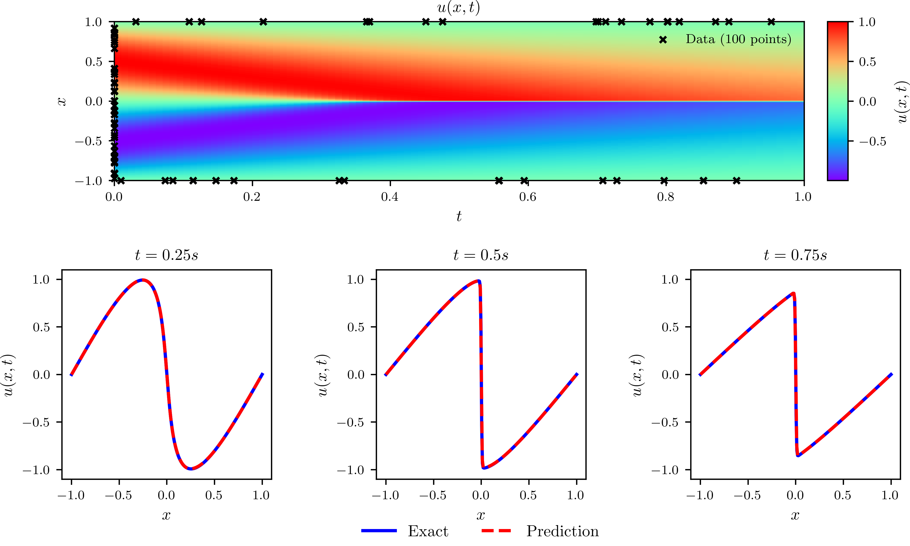
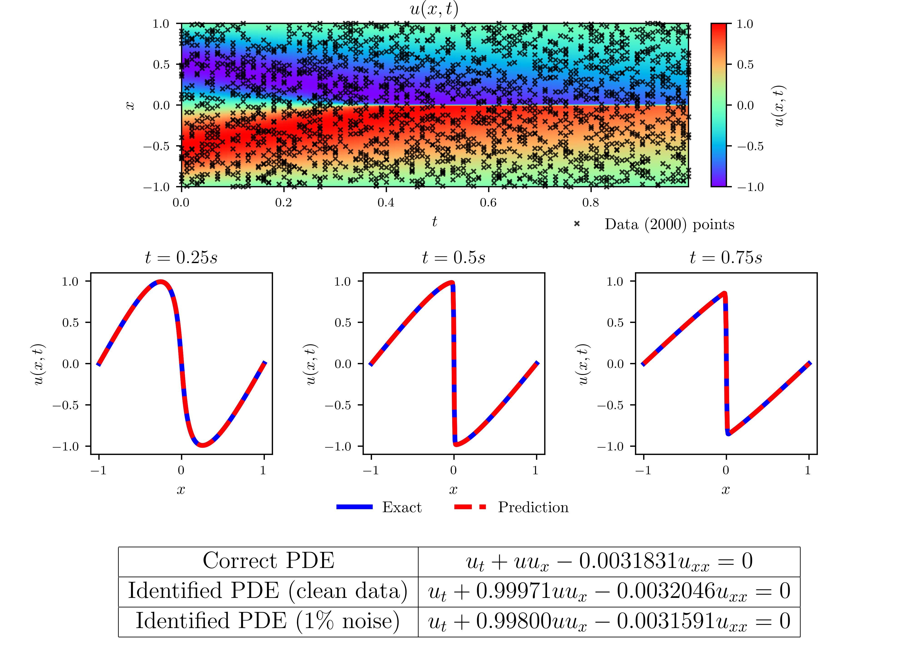
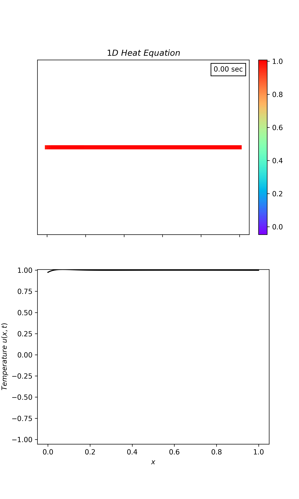
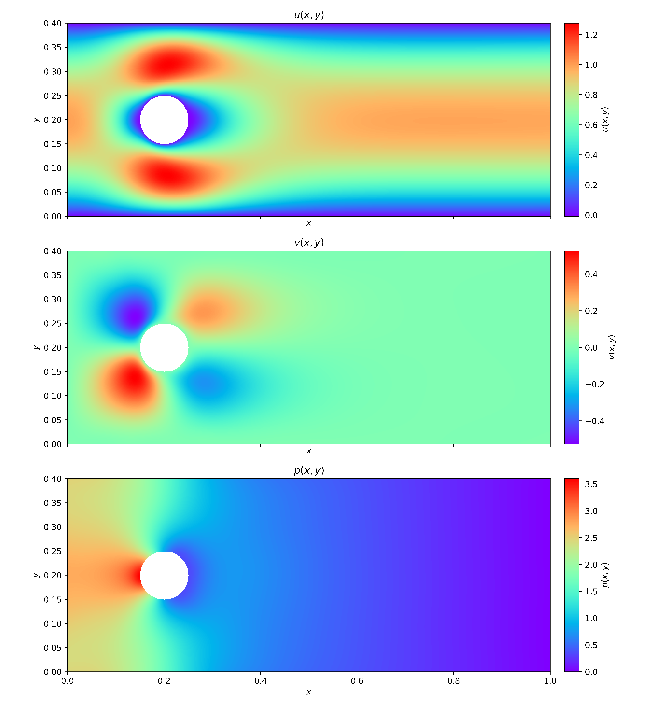
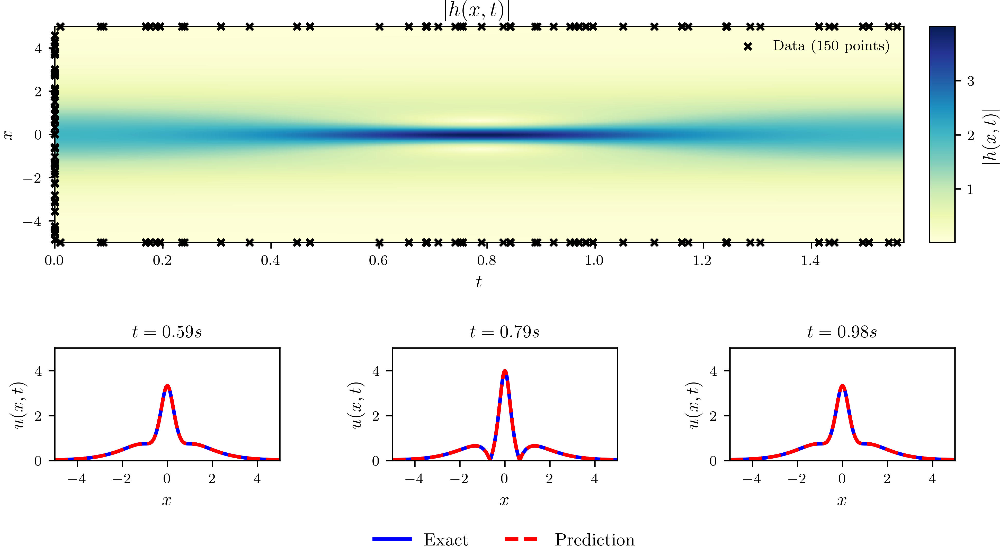
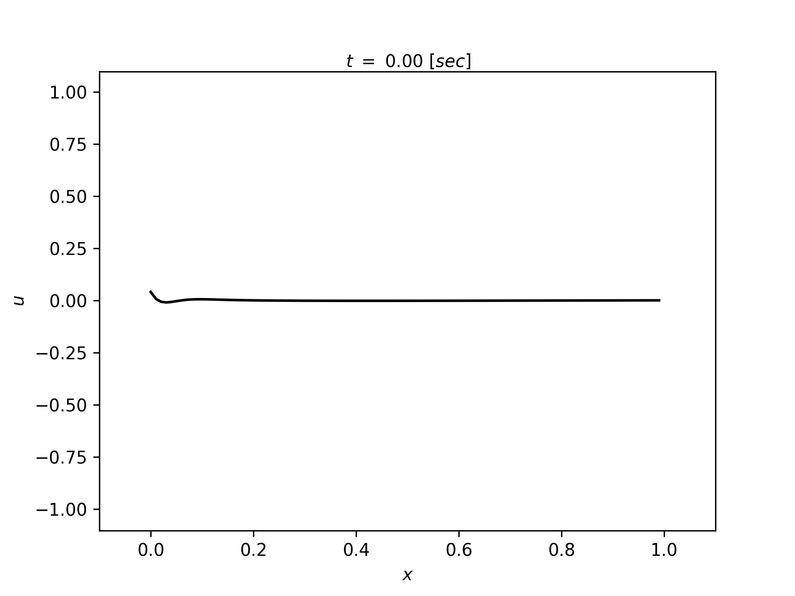
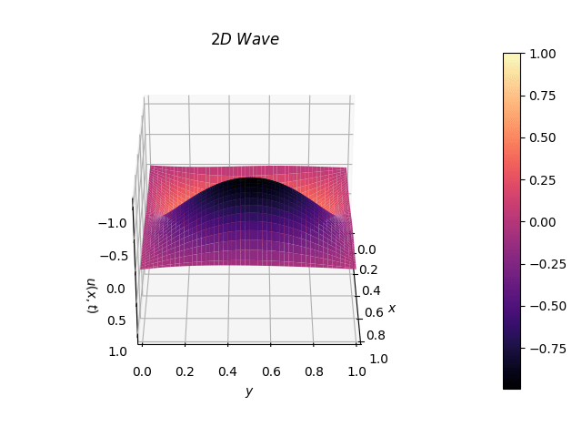

# Pytorch Implementation of Physics-informed-Neural-Networks(PINNs) 

PINNs were designed to solve a partial differential equation(PDE) by Raissi et al.  
The loss of PINNs is defined as PDE loss at collocation points and initial condition(IC) loss, boundary condition(BC) loss.
I recommend you to read [this](https://maziarraissi.github.io/PINNs/) for more details.
 
## Getting Started


### Prerequisites
This code has been tested with Pytorch 1.10.0, CUDA 11.5, Window 10. However, it would be fine with lower versions as well.
The library versions used are:

```
numpy 1.21.2
scipy 1.7.2
matplotlib 3.4.3
pyDOE 0.3.8
pytorch 1.10.0
```

### Installing

Install required packages:

```
pip install numpy==1.21.2 scipy==1.7.2 matplotlib==3.4.3 pydoe==0.3.8  
pip3 install torch==1.10.0+cu113 torchvision==0.11.1+cu113 torchaudio===0.10.0+cu113 -f https://download.pytorch.org/whl/cu113/torch_stable.html
```

## Running

Run the `main.py` to train PINN, then run `plot.py` to generate result.

### Result
  
<figcaption>Bergers-inference</figcaption><br>

       
<figcaption>Bergers-Identification</figcaption><br>


<figcaption>Heat Equation</figcaption><br>


<figcaption>Navier-Stokes Equation</figcaption><br>


<figcaption>Schrodinger Equation</figcaption><br>


<figcaption>1D Wave Equation</figcaption><br>


<figcaption>2D Wave Equation</figcaption><br>

## License 

This project is licensed under the MIT License - see the [LICENSE](https://github.com/git/git-scm.com/blob/main/MIT-LICENSE.txt) 

## References

- Raissi, Maziar, Paris Perdikaris, and George Em Karniadakis. "[Physics Informed Deep Learning (Part I): Data-driven Solutions of Nonlinear Partial Differential Equations](https://arxiv.org/abs/1711.10561)." arXiv preprint arXiv:1711.10561 (2017).

- Raissi, Maziar, Paris Perdikaris, and George Em Karniadakis. "[Physics Informed Deep Learning (Part II): Data-driven Discovery of Nonlinear Partial Differential Equations](https://arxiv.org/abs/1711.10566)." arXiv preprint arXiv:1711.10566 (2017).

- Raissi, Maziar, Paris Perdikaris, and George E. Karniadakis. "[Physics-informed neural networks: A deep learning framework for solving forward and inverse problems involving nonlinear partial differential equations](https://www.sciencedirect.com/science/article/pii/S0021999118307125)." Journal of Computational Physics 378 (2019): 686-707.

- Rao, C. P., H. Sun, and Y. Liu. "[Physics-Informed Deep Learning for Incompressible Laminar Flows.](https://www.sciencedirect.com/science/article/pii/S2095034920300350)" Theoretical and Applied Mechanics Letters 10.3 (2020): 207-12.